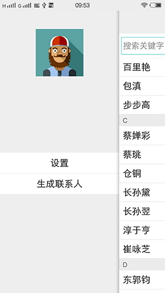

#QuickContact

最新的代码请访问该地址(https://github.com/newhope1106/RandomContact)
###快速联系人
###功能
1.显示已有联系人

2.搜索联系人

3.查看联系人

4.快速生成联系人

###依赖
运行平台：android 4.4及以上

右滑菜单库：[slidingmenu_library](https://github.com/YeXiaoChao/slidingmenu_library)

使用范例：[http://www.cnblogs.com/yc-755909659/p/4306938.html](http://www.cnblogs.com/yc-755909659/p/4306938.html)

###以下是效果
#####主列表、菜单界面
 &nbsp;&nbsp;&nbsp;

#####设置、生成随机联系人界面
 &nbsp;&nbsp;&nbsp; 
#####生成复杂联系人、系统自带详情界面
 &nbsp;&nbsp;&nbsp;

